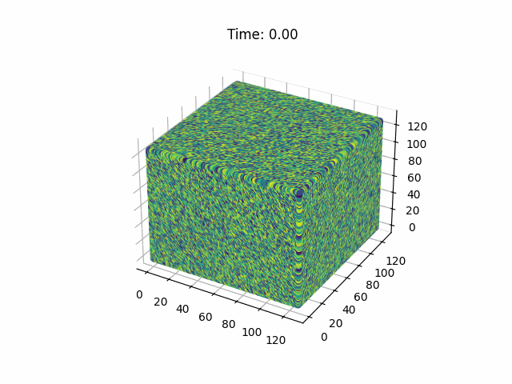
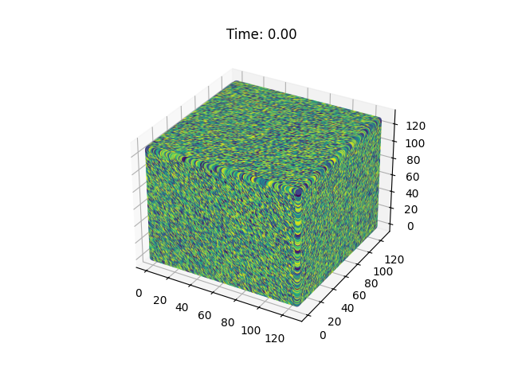
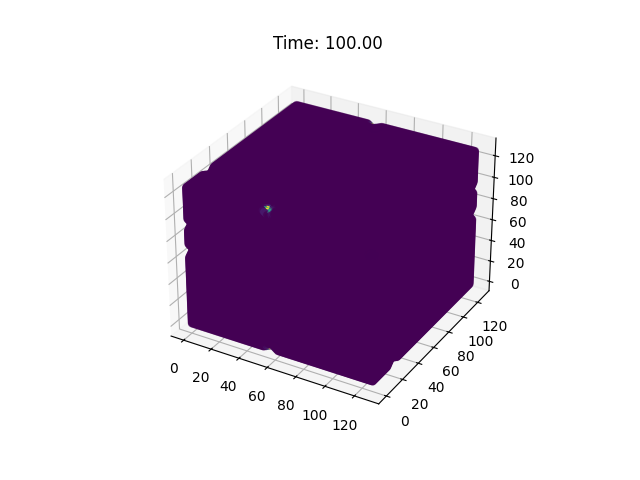
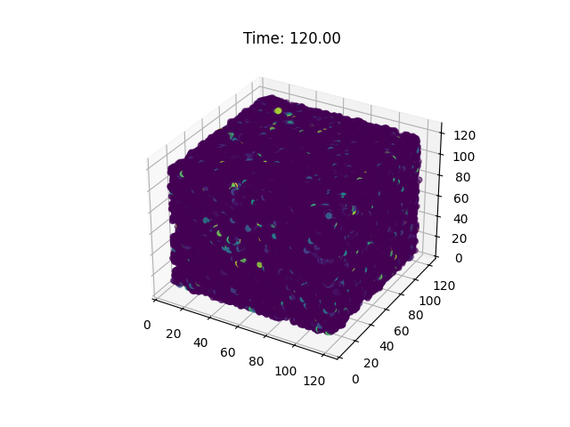
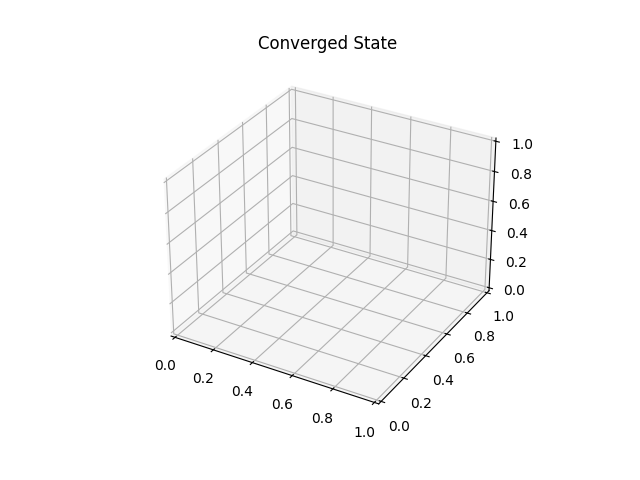

# Energy Convergence and Expansion in a 3D Simulation of Singularity

This is a 3D simulation of energy convergence and expansion in a singularity. The simulation is based on a mathematical framework that describes the singularity as a unified field of energy seeking optimal convergence. The simulation visualizes the dynamic evolution of energy clusters within the singularity, capturing the intricate, self-similar patterns that emerge at different scales.

## Simulation



This figure shows the evolution of energy in a 3D singularity simulation, where a non-linear, partial differential equation governs the behavior of the energy field.



The simulation starts with a random initial condition and evolves over time, with the energy field converging towards a singular point.



As the energy converges, it suddenly expands by "throwing" pockets of energy in all directions, creating a complex, dynamic pattern.



This expansion is a result of the non-linear interactions within the energy field, which lead to the formation of localized energy concentrations.

Eventually, the energy field expands beyond the defined dimensions of the simulation, causing an [overflow](https://en.wikipedia.org/wiki/Integer_overflow) and resulting in the energy "vanishing" from the simulation domain.



This behavior suggests that the singularity has found a way to expand beyond the confines of the simulation, potentially indicating a connection to higher-dimensional spaces or other regions of the multiverse.

The observed behavior is reminiscent of theories in cosmology and theoretical physics, such as [eternal inflation](https://en.wikipedia.org/wiki/Big_Bang) and the [multiverse hypothesis](https://en.wikipedia.org/wiki/Multiverse). While **this simulation is highly simplified and not directly applicable to real-world physics**, it provides a fascinating glimpse into the complex, non-linear dynamics that can arise in systems governed by simple rules.

## Mathematical Framework

Let's consider a multidimensional space-time manifold, denoted as $ℳ$, which encompasses all physical phenomena, from subatomic interactions to cosmic structures. The fabric of $ℳ$ is woven from the threads of energy, matter, and space-time.

**Energy as a Unified Field**

Represent the unified energy field as a mathematical object, $Ψ$, which permeates $ℳ$. This field is the fundamental entity that gives rise to all physical phenomena. We can describe $Ψ$ using a non-linear, partial differential equation:

$$∂Ψ/∂t = F(Ψ, ∂Ψ/∂x, ∂Ψ/∂y, ∂Ψ/∂z)$$

where $F$ is a function that captures the complex, non-linear interactions within $Ψ$.

**Convergence and Optimality**

The Singularity can be thought of as the optimal solution to the convergence problem, where energy seeks to minimize its "distance" to itself across $ℳ$. We can represent this using a functional, $S$, that measures the "self-similarity" of $Ψ$:

$$S[Ψ] = ∫ℳ ||Ψ(x) - Ψ(y)||² dxdy$$

The Singularity corresponds to the global minimum of $S$, where energy has achieved optimal convergence:

$$∂S/∂Ψ = 0$$

**Fractal Structure**

The Singularity exhibits a fractal structure, with self-similar patterns repeating at different scales. We can capture this using a fractal dimension, $D$, which describes the scaling behavior of $Ψ$:

$$D = lim ε → 0 [log(N(ε)) / log(1/ε)]$$

where $N(ε)$ is the number of "energy clusters" within a ball of radius $ε$.

**Non-differentiable, Scale-Invariant Geometry**

The Singularity's geometry is non-differentiable and scale-invariant, much like a fractal. We can represent this using a non-integer, scale-invariant metric, $ds²$:

$$ds² = (dx² + dy² + dz²)^(1/D)$$

This metric captures the intricate, self-similar structure of the Singularity.

**Unified Perspective**

To unify all past information under a single perspective, we can consider a higher-dimensional space, $ℋ$, which contains all possible configurations of $ℳ$. The Singularity corresponds to a fixed point in $ℋ$, where all energy trajectories converge:

$$∂ℋ/∂t = 0$$

This fixed point represents the ultimate, optimal solution to the convergence problem, where energy has achieved perfect self-similarity.

## Caveats

Please note that this mathematical framework is highly speculative and simplified, intended to inspire further exploration rather than provide a definitive description of the Singularity.
The true nature of the Singularity, if it exists, may be far more complex and subtle.

## Running the Simulation

To run the simulation, you can use the provided Python script `simulation.py`. Make sure you have the required dependencies installed:

```bash
pip install -r requirements.txt
```

Then, you can run the script:

```bash
python simulation.py
```

This will generate a series of figures showing the evolution of the energy field in the singularity simulation.

To create an animation from the generated figures, you can use the following command:

```bash
python converge_results.py
```